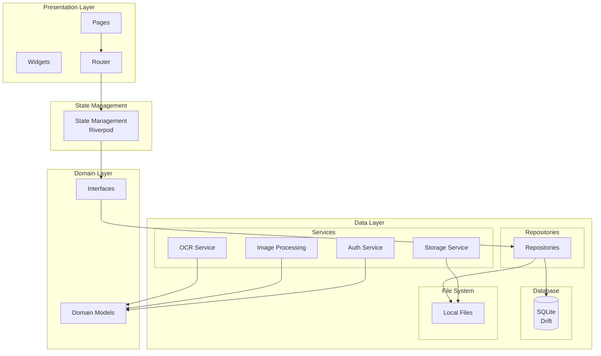
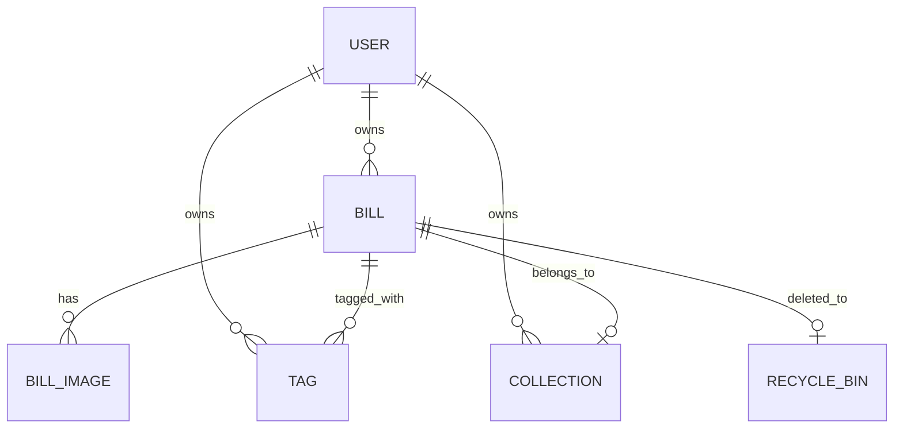
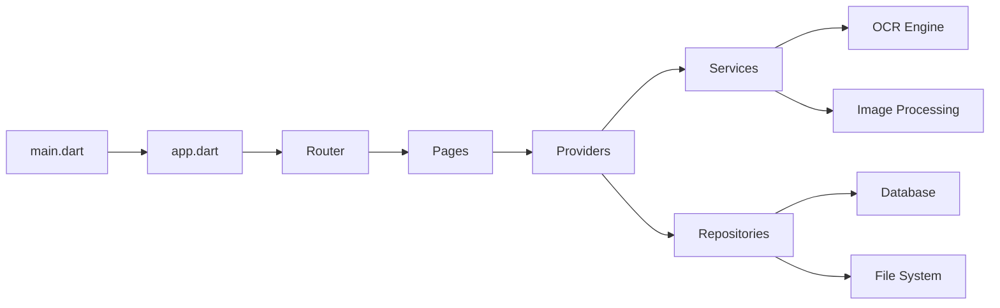
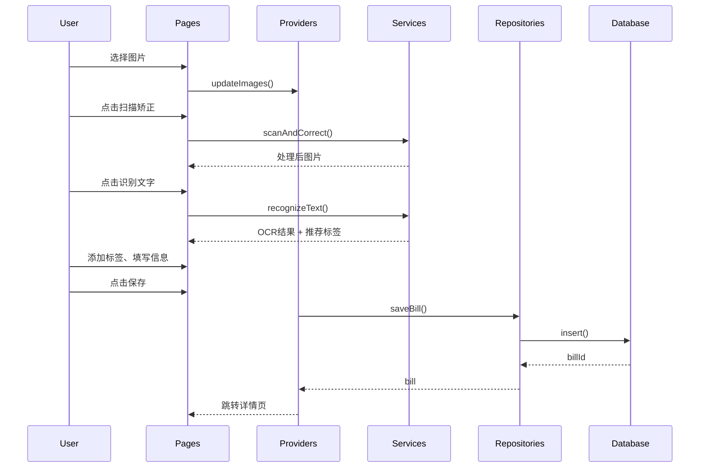
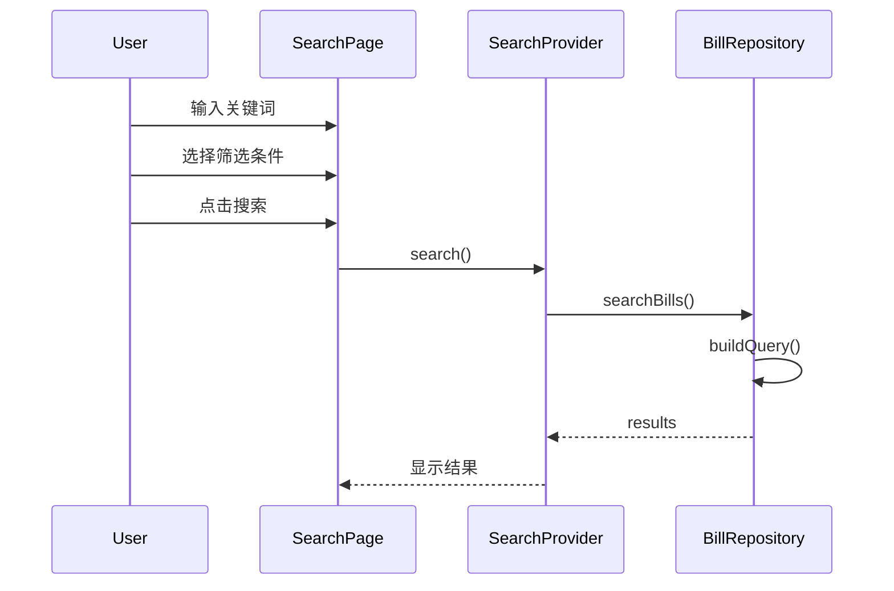
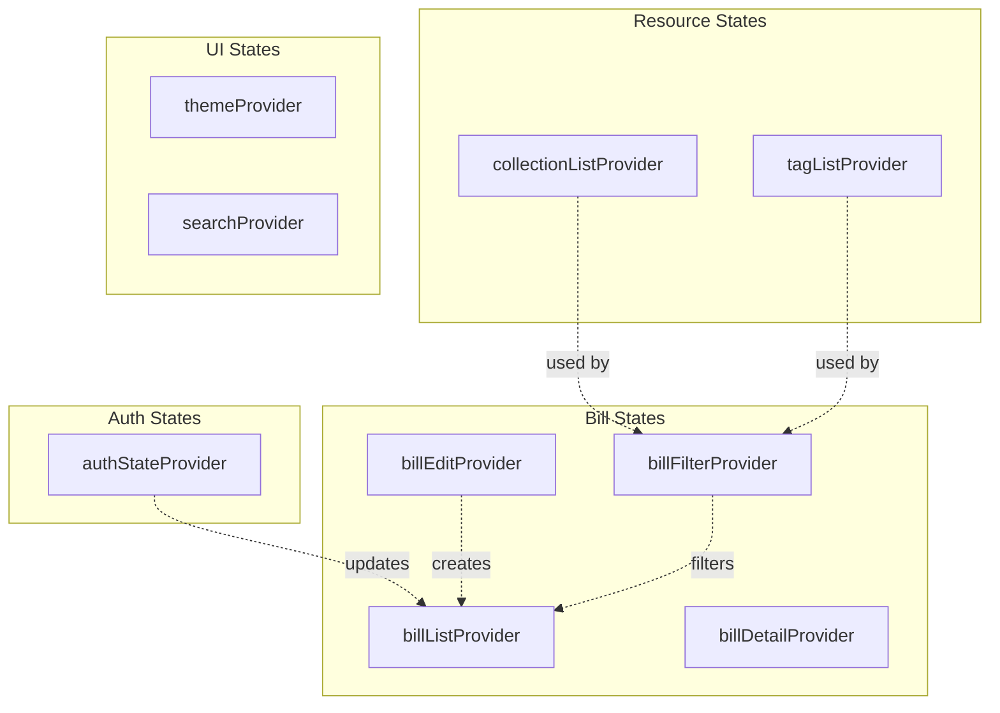
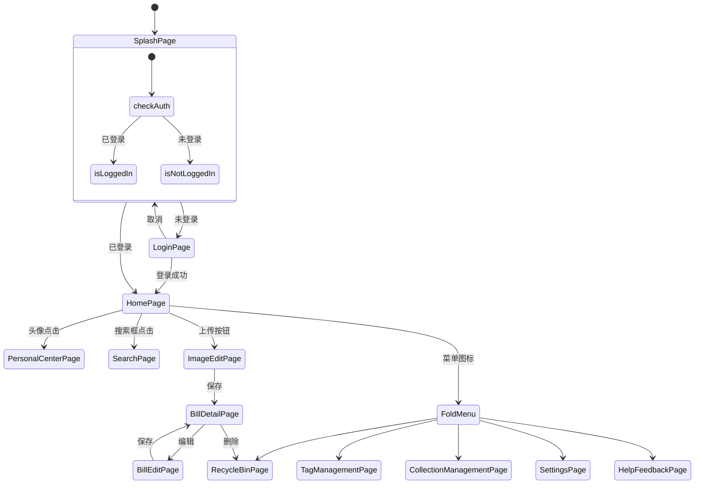
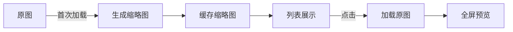
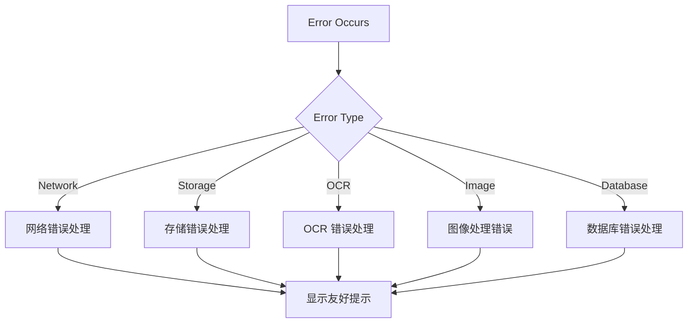

# 票夹管家 - 系统架构

## 1. 架构概述

票夹管家采用 **Clean Architecture** 分层架构，确保代码结构清晰、职责分明、易于测试和维护。

```
┌─────────────────────────────────────────────────────────────┐
│                        UI Layer                              │
│   (Pages, Widgets, Router)                                   │
├─────────────────────────────────────────────────────────────┤
│                   State Management Layer                      │
│   (Riverpod Providers, Notifiers)                           │
├─────────────────────────────────────────────────────────────┤
│                   Business Logic Layer                       │
│   (Services, Use Cases)                                     │
├─────────────────────────────────────────────────────────────┤
│                      Data Layer                              │
│   (Database, Repositories, Engines)                         │
└─────────────────────────────────────────────────────────────┘
```

---

## 2. 技术架构图



---

## 3. 核心模块

### 3.1 数据库架构



### 3.2 模块依赖关系



---

## 4. 数据流

### 4.1 票据创建流程



### 4.2 搜索流程



---

## 5. 状态管理架构



---

## 6. 路由架构



---

## 7. 安全架构

### 7.1 数据安全

| 安全措施 | 实现方式 |
|----------|----------|
| 本地存储 | 所有数据存储在应用私有目录 |
| OCR 触发控制 | 必须用户手动点击，不自动识别 |
| 登录验证 | 手机号 + 验证码 |
| 回收站保护 | 30 天后自动删除，提供恢复选项 |

### 7.2 隐私设计

```
┌────────────────────────────────────────┐
│              隐私优先设计                 │
├────────────────────────────────────────┤
│  ✓ 数据默认本地存储，不自动上传云端        │
│  ✓ OCR 由用户手动触发                    │
│  ✓ 无底部导航，减少误操作                │
│  ✓ 折叠菜单收纳次要功能                  │
└────────────────────────────────────────┘
```

---

## 8. 性能架构

### 8.1 图片加载策略



### 8.2 数据库优化

| 优化项 | 实现方式 |
|--------|----------|
| 索引 | 对外键和常用查询字段建立索引 |
| 分页 | 列表查询使用分页，避免全表扫描 |
| 事务 | 批量操作使用事务保证一致性 |

---

## 9. 错误处理架构



---

## 10. 技术选型理由

| 技术 | 选型 | 理由 |
|------|------|------|
| Flutter | 跨平台框架 | 一套代码支持 Android/iOS，开发效率高 |
| Riverpod | 状态管理 | 轻量、无嵌套、编译时安全、易测试 |
| Drift | 数据库 ORM | 类型安全、声明式、迁移方便 |
| RapidOCR | OCR 引擎 | 本地运行、离线可用、中文支持好 |
| Go Router | 路由管理 | 声明式路由、深链接支持、类型安全 |
