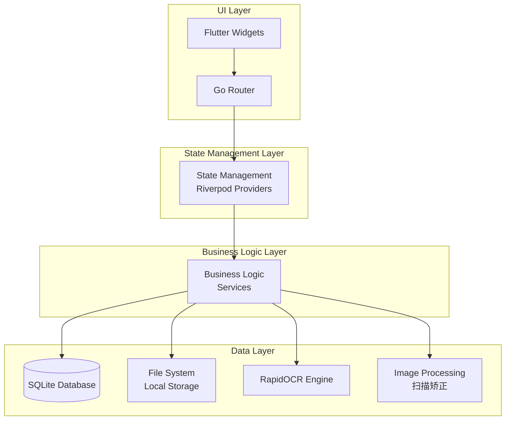
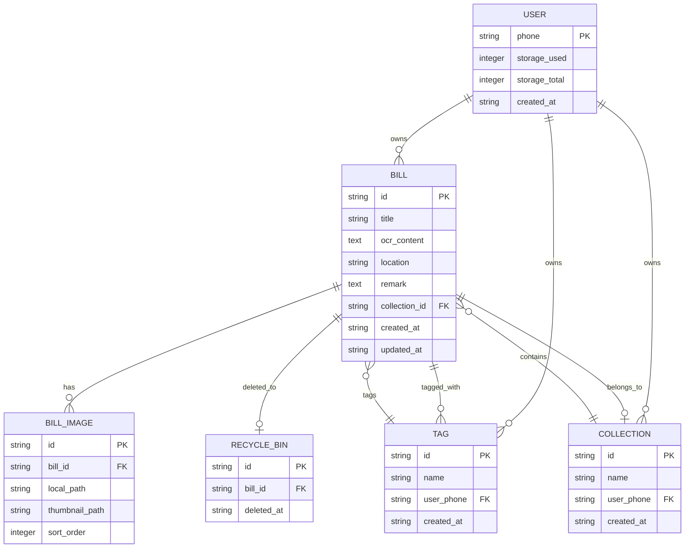
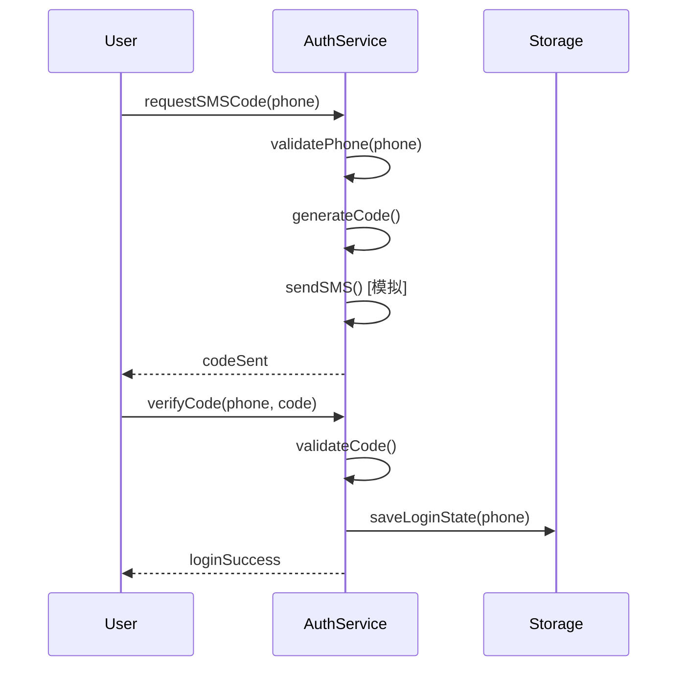
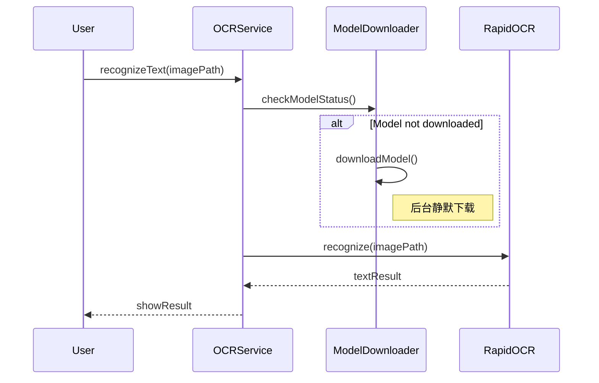
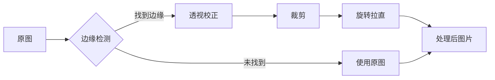
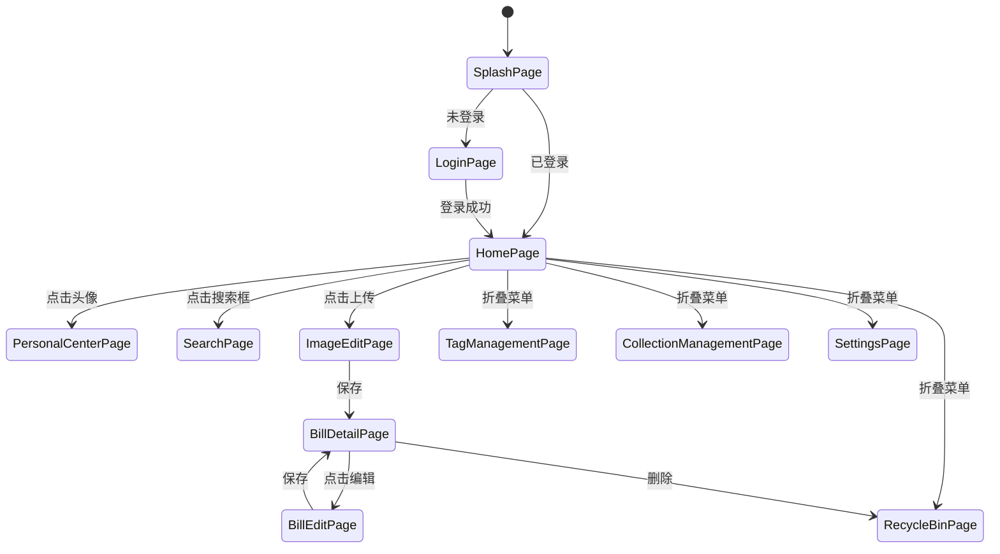
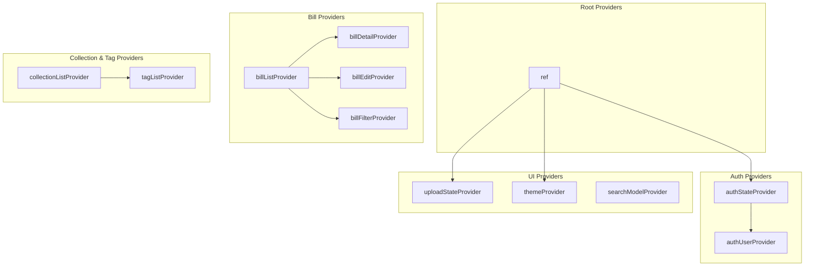

# 票夹管家 App 技术设计文档

## 1. 概述

**文档版本：** 1.0  
**更新日期：** 2026-03-24  
**项目名称：** 票夹管家  
**项目类型：** 个人票据收藏移动应用

## 2. 技术栈选型

### 2.1 跨平台框架

| 组件 | 技术选型 | 说明 |
|------|----------|------|
| 跨平台框架 | Flutter 3.x | 支持 Android 和 iOS，提供高性能渲染 |
| 开发语言 | Dart 3.x | Flutter 专用语言 |
| 状态管理 | Riverpod 2.x | 轻量级响应式状态管理 |
| 本地数据库 | SQLite (sqflite) | 本地数据持久化 |
| ORM | Drift | 类型安全的 SQLite ORM |

### 2.2 核心依赖

| 库名称 | 版本 | 用途 |
|--------|------|------|
| flutter_riverpod | ^2.4.0 | 状态管理 |
| riverpod_annotation | ^2.3.0 | 代码生成 |
| drift | ^2.14.0 | 数据库 ORM |
| sqlite3_flutter_libs | ^0.5.0 | SQLite 原生库 |
| path_provider | ^2.1.0 | 文件路径获取 |
| image_picker | ^1.0.0 | 图片选择 |
| camera | ^0.10.0 | 相机拍照 |
| image | ^4.1.0 | 图像处理 |
| rapidocr | ^1.0.0 | 本地 OCR 识别 |
| go_router | ^13.0.0 | 路由管理 |
| shared_preferences | ^2.2.0 | 轻量级配置存储 |
| flutter_local_notifications | ^16.0.0 | 本地通知（回收站清理提醒）|
| exif | ^3.3.0 | 图片 EXIF 信息读取 |

### 2.3 开发工具

| 工具 | 用途 |
|------|------|
| flutter_test | 单元测试 |
| integration_test | 集成测试 |
| build_runner | 代码生成 |
| riverpod_generator | Riverpod 代码生成 |
| drift_dev | Drift 代码生成 |

---

## 3. 系统架构

### 3.1 整体架构图



### 3.2 分层架构说明

| 层级 | 职责 | 模块 |
|------|------|------|
| UI Layer | 展示界面，处理用户交互 | Pages, Widgets |
| State Management Layer | 管理应用状态，连接 UI 与业务逻辑 | Providers, Notifiers |
| Business Logic Layer | 实现核心业务逻辑，数据处理 | Services, Use Cases |
| Data Layer | 数据持久化，文件管理，OCR 处理 | Database, Repositories, Engines |

### 3.3 目录结构

```
lib/
├── main.dart
├── app.dart
├── core/
│   ├── constants/
│   │   ├── app_constants.dart
│   │   ├── storage_constants.dart
│   │   └── ui_constants.dart
│   ├── theme/
│   │   ├── app_theme.dart
│   │   └── app_colors.dart
│   ├── utils/
│   │   ├── image_utils.dart
│   │   ├── date_utils.dart
│   │   └── storage_utils.dart
│   └── router/
│       └── app_router.dart
├── data/
│   ├── database/
│   │   ├── app_database.dart
│   │   ├── tables/
│   │   │   ├── users_table.dart
│   │   │   ├── bills_table.dart
│   │   │   ├── images_table.dart
│   │   │   ├── collections_table.dart
│   │   │   ├── tags_table.dart
│   │   │   └── recycle_bin_table.dart
│   │   └── daos/
│   │       ├── user_dao.dart
│   │       ├── bill_dao.dart
│   │       ├── image_dao.dart
│   │       ├── collection_dao.dart
│   │       ├── tag_dao.dart
│   │       └── recycle_bin_dao.dart
│   ├── repositories/
│   │   ├── user_repository.dart
│   │   ├── bill_repository.dart
│   │   ├── image_repository.dart
│   │   ├── collection_repository.dart
│   │   ├── tag_repository.dart
│   │   └── recycle_bin_repository.dart
│   └── services/
│       ├── ocr_service.dart
│       ├── image_processing_service.dart
│       ├── storage_service.dart
│       └── auth_service.dart
├── domain/
│   ├── models/
│   │   ├── user.dart
│   │   ├── bill.dart
│   │   ├── bill_image.dart
│   │   ├── collection.dart
│   │   ├── tag.dart
│   │   └── recycle_bin_item.dart
│   └── interfaces/
│       ├── i_user_repository.dart
│       ├── i_bill_repository.dart
│       └── i_ocr_service.dart
├── presentation/
│   ├── providers/
│   │   ├── auth_provider.dart
│   │   ├── user_provider.dart
│   │   ├── bill_provider.dart
│   │   ├── collection_provider.dart
│   │   ├── tag_provider.dart
│   │   ├── search_provider.dart
│   │   └── theme_provider.dart
│   ├── pages/
│   │   ├── splash_page.dart
│   │   ├── login_page.dart
│   │   ├── home_page.dart
│   │   ├── personal_center_page.dart
│   │   ├── settings_page.dart
│   │   ├── image_edit_page.dart
│   │   ├── bill_detail_page.dart
│   │   ├── bill_edit_page.dart
│   │   ├── search_page.dart
│   │   ├── tag_management_page.dart
│   │   ├── collection_management_page.dart
│   │   └── recycle_bin_page.dart
│   └── widgets/
│       ├── common/
│       │   ├── loading_widget.dart
│       │   ├── error_widget.dart
│       │   ├── empty_widget.dart
│       │   └── storage_usage_bar.dart
│       ├── home/
│       │   ├── top_bar.dart
│       │   ├── fold_menu.dart
│       │   ├── search_bar.dart
│       │   ├── upload_card.dart
│       │   ├── filter_dropdown.dart
│       │   └── bill_grid.dart
│       ├── bill/
│       │   ├── bill_card.dart
│       │   ├── image_carousel.dart
│       │   ├── tag_chip.dart
│       │   ├── info_card.dart
│       │   └── ocr_result_panel.dart
│       └── dialogs/
│           ├── confirm_dialog.dart
│           ├── input_dialog.dart
│           └── tag_select_dialog.dart
└── gen/
    └── (generated files)
```

---

## 4. 数据模型

### 4.1 数据库 ER 图



### 4.2 数据模型定义

#### 4.2.1 用户模型 (User)

```dart
class User {
  final String phone;
  final int storageUsed;
  final int storageTotal;
  final DateTime createdAt;

  static const int defaultStorageTotal = 1024 * 1024 * 1024; // 1GB
}
```

#### 4.2.2 票据模型 (Bill)

```dart
class Bill {
  final String id;
  final String title;
  final String ocrContent;
  final String? location;
  final String? remark;
  final String? collectionId;
  final DateTime createdAt;
  final DateTime updatedAt;
  final List<BillImage> images;
  final List<Tag> tags;
}
```

#### 4.2.3 图片模型 (BillImage)

```dart
class BillImage {
  final String id;
  final String billId;
  final String localPath;
  final String thumbnailPath;
  final int sortOrder;
}
```

#### 4.2.4 合集模型 (Collection)

```dart
class Collection {
  final String id;
  final String name;
  final String userPhone;
  final DateTime createdAt;
}
```

#### 4.2.5 标签模型 (Tag)

```dart
class Tag {
  final String id;
  final String name;
  final String userPhone;
  final DateTime createdAt;
}
```

#### 4.2.6 回收站项模型 (RecycleBinItem)

```dart
class RecycleBinItem {
  final String id;
  final String billId;
  final DateTime deletedAt;
}
```

---

## 5. 核心模块设计

### 5.1 认证模块 (Auth Service)



**核心接口：**

```dart
abstract class AuthService {
  Future<void> requestSMSCode(String phone);
  Future<bool> verifyCode(String phone, String code);
  Future<bool> isLoggedIn();
  Future<void> logout();
}
```

### 5.2 OCR 服务模块 (OCR Service)



**核心接口：**

```dart
abstract class OCRService {
  Future<OCRResult> recognizeText(String imagePath);
  Future<List<String>> generateRecommendedTags(String text);
  Future<bool> isModelReady();
  Future<void> downloadModel();
}
```

### 5.3 图像处理模块 (Image Processing Service)



**核心接口：**

```dart
abstract class ImageProcessingService {
  Future<String> scanAndCorrect(String imagePath);
  Future<String> rotate(String imagePath, int degrees);
  Future<String> generateThumbnail(String imagePath);
}
```

### 5.4 存储服务模块 (Storage Service)

**核心接口：**

```dart
abstract class StorageService {
  Future<int> calculateStorageUsed();
  Future<void> clearCache();
  Future<String> saveImage(File image);
  Future<void> deleteImage(String path);
  Future<int> getTotalStorage();
}
```

---

## 6. 页面导航流程

### 6.1 路由结构



### 6.2 路由配置

```dart
// app_router.dart
final routes = [
  GoRoute(path: '/', builder: (_, __) => SplashPage()),
  GoRoute(path: '/login', builder: (_, __) => LoginPage()),
  GoRoute(path: '/home', builder: (_, __) => HomePage()),
  GoRoute(path: '/personal-center', builder: (_, __) => PersonalCenterPage()),
  GoRoute(path: '/settings', builder: (_, __) => SettingsPage()),
  GoRoute(path: '/image-edit', builder: (_, __) => ImageEditPage()),
  GoRoute(path: '/bill/:id', builder: (_, state) => BillDetailPage(id: state.pathParameters['id']!)),
  GoRoute(path: '/bill/:id/edit', builder: (_, state) => BillEditPage(id: state.pathParameters['id']!)),
  GoRoute(path: '/search', builder: (_, __) => SearchPage()),
  GoRoute(path: '/tag-management', builder: (_, __) => TagManagementPage()),
  GoRoute(path: '/collection-management', builder: (_, __) => CollectionManagementPage()),
  GoRoute(path: '/recycle-bin', builder: (_, __) => RecycleBinPage()),
];
```

---

## 7. 状态管理设计

### 7.1 Provider 结构



### 7.2 主要 Provider 定义

```dart
// Auth Provider
@riverpod
class AuthNotifier extends _$AuthNotifier {
  @override
  Future<AuthState> build();
}

// Bill List Provider
@riverpod
class BillListNotifier extends _$BillListNotifier {
  @override
  Future<List<Bill>> build(BillFilter? filter);
}

// Theme Provider
@riverpod
class ThemeNotifier extends _$ThemeNotifier {
  @override
  ThemeMode build();
}
```

---

## 8. 错误处理策略

### 8.1 错误类型定义

```dart
enum AppErrorType {
  network,
  storage,
  ocr,
  imageProcessing,
  database,
  auth,
  unknown,
}

class AppException implements Exception {
  final AppErrorType type;
  final String message;
  final dynamic originalError;
}
```

### 8.2 全局错误处理

| 场景 | 处理策略 |
|------|----------|
| 网络中断 | 显示友好的错误提示，使用本地缓存数据 |
| OCR 失败 | 显示错误信息，提供重试按钮 |
| 存储空间满 | 提示用户清理空间，显示存储使用情况 |
| 扫描矫正失败 | 显示错误信息，保留原图 |
| 数据库错误 | 记录错误日志，尝试恢复或提示用户 |

### 8.3 用户反馈机制

```dart
// 使用 flutter_local_notifications 发送本地通知
Future<void> showErrorNotification(String title, String message) async {
  // 实现通知逻辑
}
```

---

## 9. 实施阶段规划

### 9.1 第一阶段：基础框架与用户系统 (2 周)

| 任务 | 工期 | 依赖 |
|------|------|------|
| 项目初始化与依赖配置 | 1 天 | - |
| 数据库设计与实现 | 2 天 | - |
| 用户登录模块 | 3 天 | 数据库 |
| 首页布局 | 3 天 | 登录模块 |
| 折叠菜单 | 1 天 | 首页布局 |
| 个人中心页 | 1 天 | 登录模块 |
| 设置页 | 1 天 | - |

### 9.2 第二阶段：核心票据管理与扫描矫正 (3 周)

| 任务 | 工期 | 依赖 |
|------|------|------|
| 图片选择与上传 | 2 天 | 第一阶段 |
| 扫描矫正功能 | 3 天 | 图片选择 |
| OCR 集成 | 3 天 | 扫描矫正 |
| 标签推荐 | 2 天 | OCR |
| 票据编辑页 | 2 天 | 标签推荐 |
| 票据详情页 | 2 天 | 扫描矫正 |
| 图片管理 | 2 天 | 详情页 |

### 9.3 第三阶段：搜索与管理 (2 周)

| 任务 | 工期 | 依赖 |
|------|------|------|
| 搜索功能 | 3 天 | 第二阶段 |
| 标签管理 | 2 天 | 搜索功能 |
| 合集管理 | 2 天 | 搜索功能 |
| 回收站 | 2 天 | 合集管理 |

### 9.4 第四阶段：测试与基础发布 (2 周)

| 任务 | 工期 | 依赖 |
|------|------|------|
| 单元测试 | 3 天 | 各模块 |
| 集成测试 | 2 天 | 单元测试 |
| 性能优化 | 2 天 | 集成测试 |
| 发布准备 | 2 天 | 性能优化 |

---

## 10. 测试策略

### 10.1 测试金字塔

```
         /\
        /E2E\
       /-----\
      /Integration
     /-----------
    /Unit Tests--
   /--------------
```

### 10.2 测试覆盖要求

| 测试类型 | 覆盖率要求 | 工具 |
|----------|------------|------|
| 单元测试 | 80%+ | flutter_test |
| 集成测试 | 关键流程全覆盖 | integration_test |
| E2E 测试 | 核心用户路径 | flutter_driver |

### 10.3 关键测试场景

1. **登录流程：** 手机号格式验证 → 验证码发送 → 验证码验证 → 登录状态保存
2. **票据创建：** 图片选择 → 扫描矫正 → OCR 识别 → 标签添加 → 保存
3. **搜索流程：** 关键词搜索 → 标签筛选 → 合集筛选 → 日期筛选 → 排序
4. **回收站流程：** 删除票据 → 恢复票据 → 彻底删除

---

## 11. 附录

### 11.1 数据库索引

```sql
-- bills 表索引
CREATE INDEX idx_bills_collection ON bills(collection_id);
CREATE INDEX idx_bills_created_at ON bills(created_at DESC);

-- bill_images 表索引
CREATE INDEX idx_images_bill_id ON bill_images(bill_id);

-- tags 表索引
CREATE INDEX idx_tags_user ON tags(user_phone);

-- bill_tags 关联表索引
CREATE INDEX idx_bill_tags_bill ON bill_tags(bill_id);
CREATE INDEX idx_bill_tags_tag ON bill_tags(tag_id);
```

### 11.2 图片存储策略

| 类型 | 存储位置 | 清理策略 |
|------|----------|----------|
| 原图 | 应用私有目录 /images | 不自动清理 |
| 缩略图 | 应用缓存目录 /thumbnails | 清除缓存时清理 |
| 扫描矫正后 | 替换原图路径 | 不自动清理 |

### 11.3 OCR 模型管理

| 状态 | 处理策略 |
|------|----------|
| 未下载 | 后台静默下载，显示加载状态 |
| 下载中 | 显示下载进度 |
| 下载失败 | 显示错误提示，允许重试 |
| 已下载 | 直接使用 |

---

## 12. 参考资料

- [Flutter 官方文档](https://flutter.dev/docs)
- [Riverpod 文档](https://riverpod.dev/)
- [Drift 数据库文档](https://drift.dev/)
- [RapidOCR 文档](https://github.com/RapidAI/RapidOCR)
- [Go Router 文档](https://gorouter.dev/)
